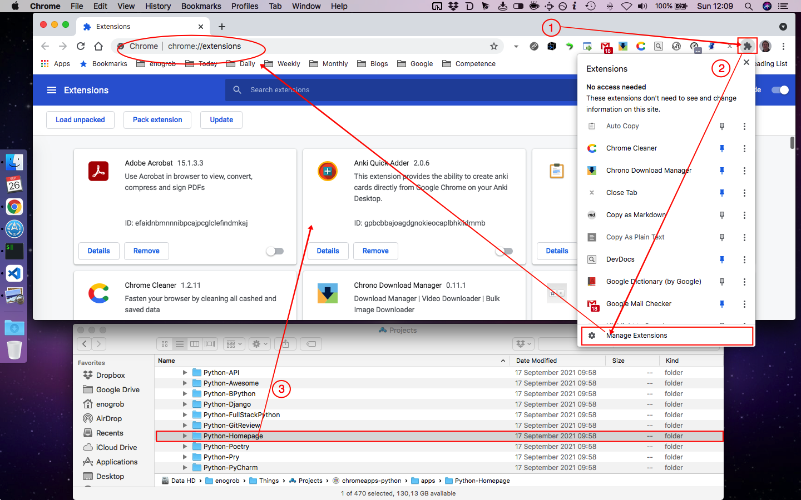
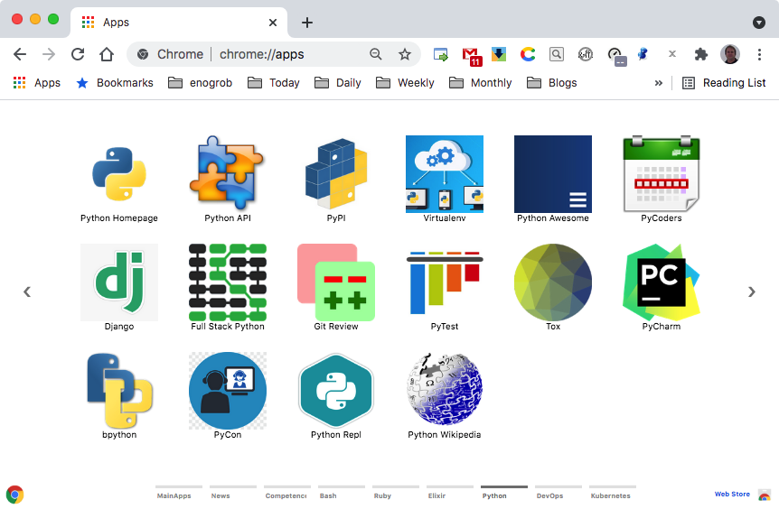

# Chrome Apps for Python

Gather Python important references and shortcuts in form of Chrome Apps.


## Installation

### 1. Clone this repository and see its contents.
Open a terminal give the following command:

```bash
$ git clone https://github.com/enogrob/chromeapps-python.git
$ cd chromeapps-python
```

As we can see a subdirectory is created for each Python app.

```bash
$ ls -la
total 400
drwxr-xr-x@   8 enogrob  staff    272 May 15 05:37 .
drwxr-xr-x@ 357 enogrob  staff  12138 May 14 14:25 ..
drwxr-xr-x   13 enogrob  staff    442 May 15 05:37 .git
-rw-r--r--    1 enogrob  staff     13 May 14 14:25 .gitignore
-rw-r--r--@   1 enogrob  staff      0 May 14 14:25 Icon?
-rw-r--r--@   1 enogrob  staff   1994 May 15 05:36 README.md
drwxr-xr-x   14 enogrob  staff    476 May 15 05:16 apps
drwxr-xr-x    4 enogrob  staff    136 May 15 05:35 images

$ tree -L 1 apps/
apps
├── Python-API
├── Python-Awesome
├── Python-BPython
├── Python-Django
├── Python-FullStackPython
├── Python-GitReview
├── Python-Homepage
├── Python-Poetry
├── Python-Pry
├── Python-PyCharm
├── Python-PyCoders
├── Python-PyCon
├── Python-PyPI
├── Python-PyTest
├── Python-PythonRepl
├── Python-Tox
├── Python-Virtualenv
└── Python-Wikipedia

18 directories, 0 files

# in order to open Files in "Linux" to drag the App folders if wanted.
$ cd apps
$ xdg-open .&
```

### 2. Open Chrome with the following url:
In order to load the `Chrome Apps` for Python, check `Developer Mode` and press `Load unpacked extension...` to load each App selecting its corresponding directory inside `apps` e.g. `Python-Homepage`, and then repeat that for the wanted apps. 


Or just drag and drop the app folder on the [Extensions page](chrome://extensions).



### 3. After load the Chrome Apps wanted for Python, Chrome will look like the screenshot below:



Pressione the Chrome "Apps" button and then look for the ones you have inserted. You can drag as you want in order to put them in desired order.
